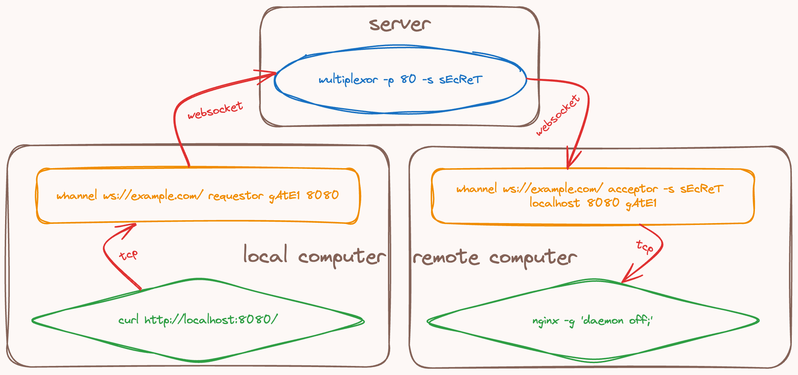

# Wultiplexor

## What?

Wultiplexor is a reverse proxy server and client that uses websockets server to multiplex tcp connections or unix sockets.
You can use it to forward connections from one machine to another both behind NAT or firewall.

## How?

<picture>
  
</picture>

## Deploy server using docker compose

```shell
docker network create wultiplexor
DOMAIN=wultiplexor.example.com ACME_EMAIL=acme@example.com SECRET=sEcReTkEy docker compose -p wultiplexor -f compose.yaml up --build -d
```

## Install the client utility

```shell
pip install wultiplexor
```

## Usage: Forward tcp port

- On one machine, called the server or acceptor:

```shell
whannel ws://example.com/ acceptor -s sEcReTkEy localhost 8080 sEcReTGaTeWaYnAmeE
```

```shell
nc -l 8080
```

- On another machine, called client or requestor:

```shell
whannel ws://example.com/ requestor sEcReTGaTeWaYnAmeE 9090
```

```shell
nc localhost 9090
```

And now you can chat between two machines.

## Usage: Forward unix socket file

- On one machine, called the server or acceptor:

```shell
whannel wss://example.com/ sock-acceptor -s sEcReTkEy ./server sEcReTGaTeWaYnAmeE
```

```shell
socat UNIX-LISTEN:./server,fork STDIO
```

- On another machine, called client or requestor:

```shell
whannel wss://example.com/ sock-requestor sEcReTGaTeWaYnAmeE ./client
```

```shell
socat STDIO UNIX-CONNECT:./client
```

And now you can chat between two machines.
